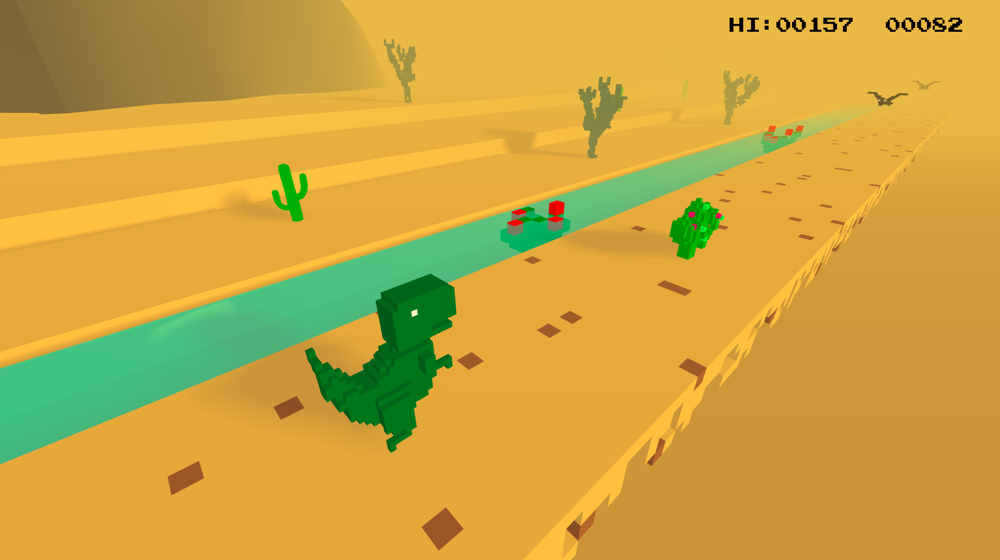

# Dino Run 3D

## Descrizione

 Dino Run 3D è una copia completa in 3D del famoso browser game 2D di Google Chrome dedicato ai dinosauri. Il gioco è codificato con l'aiuto del framework THREE.js e i modelli sono creati con l'editor artistico Magica Voxel.

Tech-stack

 Il progetto è realizzato interamente con Javascript.

 Il 3D è realizzato con il framework THREE.js [link](https://github.com/mrdoob/three.js/).

 Modelli creati con MagicaVoxel art editor [link](https://ephtracy.github.io/).

## Tech-stack

 Il progetto è realizzato interamente con Javascript 

 Il 3D è realizzato con il framework THREE.js https://github.com/mrdoob/three.js/ 

 Modelli creati con MagicaVoxel art editor https://ephtracy.github.io/ 

##Installazione

Per installare Dino Run 3D sul tuo computer, segui questi semplici passaggi: 

 1. Scarica il file zip da GitHub: Vai alla pagina del repository su GitHub, clicca sul pulsante 'Code' e seleziona 'Download ZIP'. 

 2. Clona la repository di Three.js: Apri il terminale e esegui il seguente comando per clonare la repository nel tuo ambiente di sviluppo: 'git clone --depth=1 https://github.com/mrdoob/three.js.git' 

 3. Installa i requisiti: Assicurati di avere Node.js installato sul tuo computer. Apri il terminale nella cartella del progetto appena clonato e esegui il seguente comando per installare tutti i requisiti: 'npm install express' 

 4. Esegui il gioco: Una volta installati i requisiti, esegui il seguente comando per avviare il gioco: 'npm run dev' 

 Ora il gioco dovrebbe essere in esecuzione sul tuo computer in 'localhost:9000'! Goditi l'avventura e buon divertimento! 

## Screenshot:

## Autore:
Sviluppatore Simeone Daniele e Scala Fabio